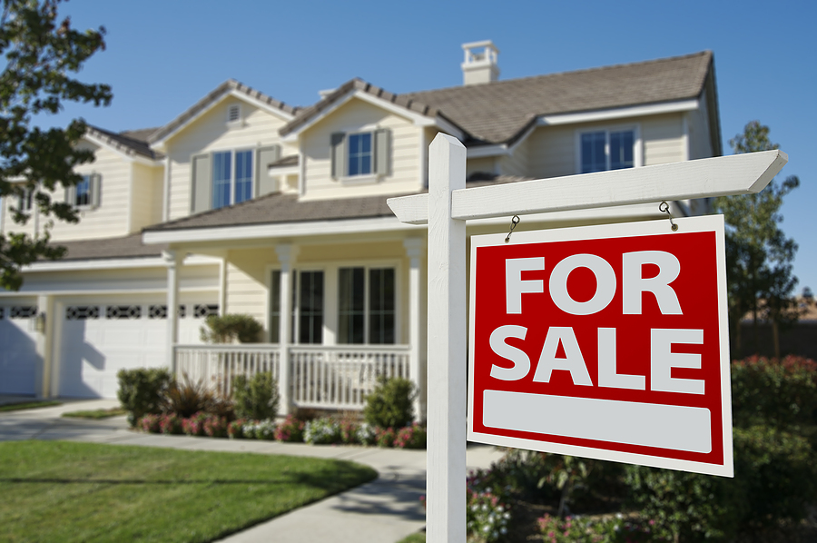

# King-County-Washington-House-Sales-Tableau-Project

## Introduction

This interactive dashboard presents a comprehensive analysis of King County, Washington, house sales utilizing Tableau. The dataset focuses on the years 2014 and 2015, aiming to unveil insights into various aspects such as daily average house sales prices, distribution of house prices, bedroom trends, and more. Explore the visualizations to gain a deeper understanding of the housing market dynamics in King County during this period.
